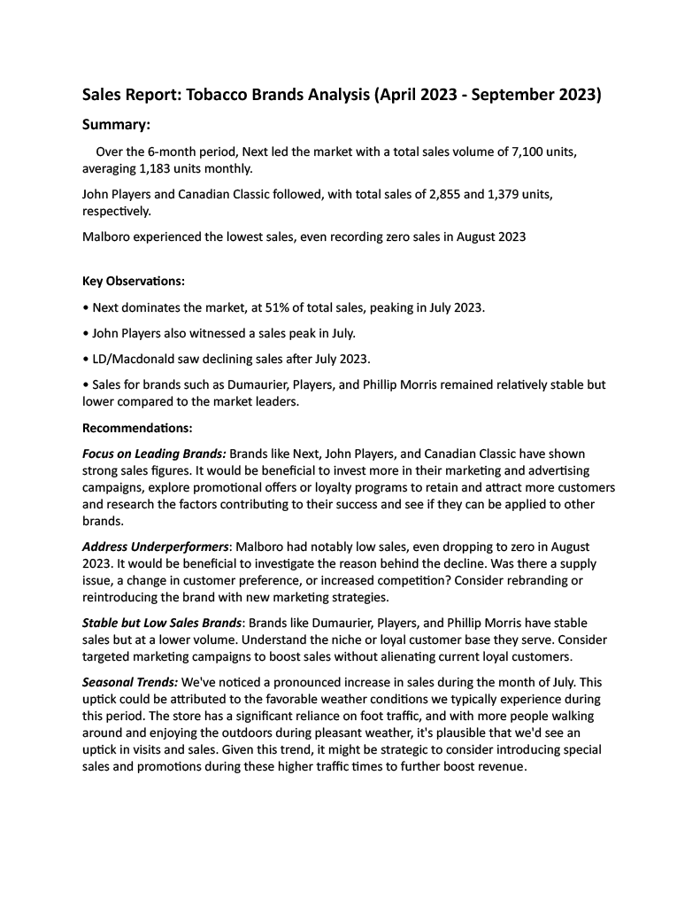
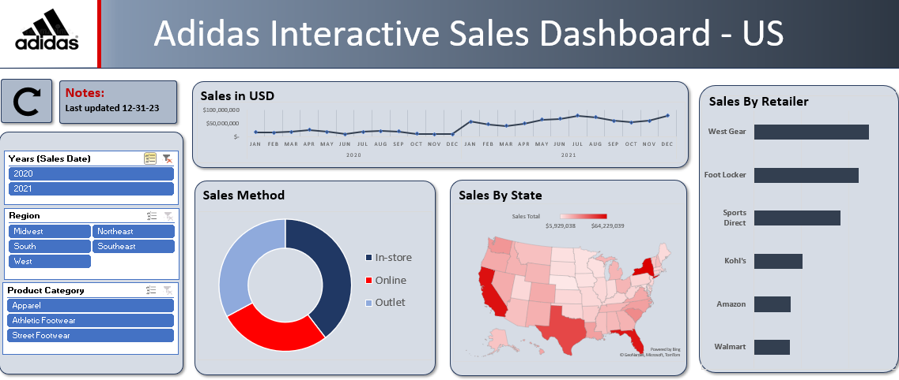

# Small Business Owner/Operator

# Entrepreneur

#### Technical Skills: Excel, SQL, R, Tableau

## Education

- *NSCC, Investment Management* - Comprehensive study of investment principles and practices, covering asset allocation, portfolio construction, and risk management. Explores various investment vehicles, including stocks, bonds, and mutual funds, as well as insurance, and group benefit plans. Emphasizes analytical techniques and real-world applications to optimize investment returns and achieve financial objectives.

- *Google Data Analyst Certification* - A foundational course comprised of eight inner courses developed by Google, covering the complete data analysis process using tools like Excel, SQL, R, and Tableau. Includes hands-on projects and real-world case studies, culminating in a professional certificate.

## Work Experience

**Personal Financial Advisor, Corporate Group Benefit Sales : Freedom 55 Financial 2011-2013**

- Assisted clients in managing their finances by providing expert advice on investments, insurance, retirement, and other financial matters. I analyzed clients' financial situations, understood their goals, and developed tailored financial strategies. I helped ensure clients' financial security and growth through informed decision-making.

**Store Manager - Leonardos Convenience 2013-2018**

- Managed daily operations, inventory, and a team of staff, ensuring customer satisfaction.
- Collaborated on promotions, increasing foot traffic, and assisted in financial tasks, including product ordering, data input, and payroll management.

**Owner/Operator - Leonardos Convenience 2018-Present** 

- Transitioned from manager to owner, driving consistent revenue growth and reducing operational costs. Expanded product range and fostered supplier relationships, while leading a dedicated team and emphasizing professional development.

## Projects

### **Cyclistic Bike Share Case Study (Google Data Analytics Course, Coursera)**

**Link to Kaggle Project - [here](https://www.kaggle.com/code/scotclark/cyclistic-case-study/report)**

The case study revolves around Cyclistic, a bike-sharing service in Chicago. The primary objective is to understand how casual riders and annual members use Cyclistic bikes differently. By analyzing and interpreting data from multiple sources, analysts are tasked with providing actionable insights that can help Cyclistic convert casual riders into annual members.

**Key components of the case study include:**

-*Data Collection*: Gathering data from public sources, especially the City of Chicago's Divvy Bikes dataset.

-*Data Cleaning*: Preprocessing the data to handle missing values, outliers, and inconsistencies.

-*Exploratory Data Analysis (EDA)*: Understanding patterns, trends, and relationships in the data.

-*Data Visualization*: Creating visual representations to communicate findings effectively.

-*Recommendation*s: Based on the analysis, suggesting strategies for Cyclistic's marketing team to target casual riders.

### **Tobacco Sales Analysis (6-Month Period)**

Constructed a detailed sales report focusing on tobacco sales, segmented by brand and volume. Analyzed overall and average sales, identified key trends in brand performance, and leveraged insights to enhance negotiation strategies for annual contract plans, as well as potential marketing strategies moving forward.

   

**Skills in Analyzing & Reporting from Excel Data:**

-*Excel Mastery*: Proficient in formulas, pivot tables, data management, and visualization.

-*Data Analysis*: Adept at discerning trends, patterns, and anomalies.

-*Clear Communication*: Skilled in crafting concise reports with actionable insights.

-*Detail-Oriented*: Ensures accuracy and thoroughness in data interpretation.

### **Interactive Sales Dashboard: Excel-Based Data Analysis & Visualization**

#### **Project Overview:**
Constructed an advanced, interactive sales dashboard using Excel, underlining competencies in data organization, visualization, communication, and end-to-end project execution.

*Process & Execution:*

*Data Cleaning & Preparation*: Conducted meticulous data preprocessing, which included reformatting inconsistencies, eliminating incomplete data entries, and segregating columns to streamline subsequent analyses.

*Analytical Techniques* :Leveraged pivot tables to create specific datasets, facilitating the creation of comparative visualizations that inform the dashboard's core.

*Dashboard Development*: Designed a user-centric dashboard interface that intuitively communicates sales metrics across diverse subcategories. This dynamic platform caters to varied user requirements, transcending the limitations of traditional static reports.

[Download here](docs/assets/AdidasInteractiveDashboard1.xlsx) 

